# YCZX Code Lab

面向燕中生态成员的长期学习、练习与协作仓库。这里负责帮助新成员学会开发、完成实验和熟悉 Pull Request；各项目的正式产品代码仍在对应的正式仓库中维护。

当前唯一关键主线是 **YCZX Code v0.1**：先共同学习 `hello-agents` 与 `learn-claude-code`，再把真正成熟的设计和实现提交到 [YCZX Code 正式仓库](https://github.com/yanchuaner/yczx_code)。未来其他项目也可以复用本仓库的学习与协作框架。

## 仓库边界

| 内容 | 放在本仓库 | 放在正式项目仓库 |
| --- | --- | --- |
| 环境、Git 和 PR 教程 | 是 | 通常不重复维护 |
| 每周任务与会议公开资料 | 是 | 否 |
| 个人学习记录与练习代码 | 是 | 否 |
| 可复现的教学示例 | 是 | 仅在成为正式功能后迁移 |
| 产品功能、发布代码和生产配置 | 否 | 是 |

练习代码不会自动进入正式项目。值得采用的方案，需要在正式仓库中重新确认需求、模块边界、测试和安全规则。

## 从入门到合并

```mermaid
flowchart LR
    newMember["新成员"] --> setupEnv["配置开发环境"]
    setupEnv --> learnGit["完成 Git 教程"]
    learnGit --> readTask["阅读本周任务"]
    readTask --> createBranch["创建个人分支"]
    createBranch --> finishWork["完成学习记录或练习"]
    finishWork --> localCheck["本地检查"]
    localCheck --> openPr["发起 Pull Request"]
    openPr --> reviewWork["评审与修改"]
    reviewWork --> mergeMain["合并到 main"]
```



一句话记住：**先同步 `main`，再创建自己的分支；只修改自己的文件；检查后发起 PR。**

## 新成员快速开始

1. 阅读 [`AGENTS.md`](./AGENTS.md)，了解安全和协作底线。
2. 按 [`Windows 环境配置`](./docs/setup/windows.md) 安装 Git、Python 3.12、uv 和 VS Code。
3. 阅读 [`Git 核心概念`](./docs/git/concepts.md)，再照着 [`Git 完整上手流程`](./docs/git/quickstart.md) 做一遍。
4. 进入 [`项目入口`](./projects/README.md)，找到当前项目与本周任务。
5. 用 [`学习记录模板`](./docs/templates/learning-record.md) 或 [`练习报告模板`](./docs/templates/exercise-report.md) 创建自己的文件。
6. 按 [`Pull Request 流程`](./docs/workflow/pull-request.md) 提交、评审和合并。

遇到问题先查看 [`Git 排错指南`](./docs/git/troubleshooting.md)，仍无法解决时使用仓库的“学习问题”Issue 模板。提问时不要粘贴 API Key、访问令牌或个人资料。

## 目录怎么使用

| 目录 | 放什么 | 谁主要修改 |
| --- | --- | --- |
| [`docs/`](./docs/README.md) | 环境、Git、协作、模板、会议和维护文档 | 全体成员与维护者 |
| [`projects/`](./projects/README.md) | 各项目的学习入口、教程和每周任务 | 项目负责人 |
| [`learning-records/`](./learning-records/README.md) | 本人独立完成的每周学习记录 | 每位成员只改自己的目录 |
| [`exercises/`](./exercises/README.md) | 个人实验和练习代码 | 每位成员只改自己的目录 |
| [`examples/`](./examples/README.md) | 已整理、可重复运行的公共示例 | 先沟通，再共同维护 |

成员文件统一使用 GitHub 用户名，不使用真实姓名。例如：

```text
learning-records/yczx_code/your-github-id/week-01.md
exercises/yczx_code/your-github-id/week-02/03_agent_loop.py
```

## 当前学习主线

YCZX Code 的学习任务和教程位于 [`projects/yczx_code/`](./projects/yczx_code/README.md)。真实案例按难度逐步增加：

| 阶段 | 学习目标 | 案例入口 |
| --- | --- | --- |
| 1 | 发起第一次真实模型对话 | [`01_first_chat.py`](./examples/yczx_code/01_first_chat.py) |
| 2 | 理解 Tool Schema 和工具请求 | [`02_first_tool_call.py`](./examples/yczx_code/02_first_tool_call.py) |
| 3 | 完成 Tool Result 与 Agent Loop | [`03_agent_loop.py`](./examples/yczx_code/03_agent_loop.py) |
| 4 | 加入 ReAct、最大步数和只读边界 | [`04_readonly_react_agent.py`](./examples/yczx_code/04_readonly_react_agent.py) |
| 5 | 理解 Provider、工具注册和模块化 | [`05_mini_agent/`](./examples/yczx_code/05_mini_agent/README.md) |

真实模型请求可能产生费用。API Key 只能放在当前终端的环境变量中，不能写入代码、Markdown、`.env`、截图或 Git 历史。

## 日常协作规则

- 不直接推送 `main`，每项任务使用独立分支和 Pull Request。
- 分支建议命名为 `week-XX/<github-id>/<short-topic>`。
- 开始任务前执行 `git switch main` 和 `git pull --ff-only`。
- 学习记录必须本人独立完成，AI 可以辅助理解和检查，但不能代写感悟。
- 个人练习只修改自己的目录；修改公共教程或示例前先在 Issue 或群里说明。
- 一个 PR 只处理一个主题，并写清目的、改动和实际验证命令。
- PR 合并后删除旧分支，从最新 `main` 创建下一项任务的分支。

完整贡献规则见 [`CONTRIBUTING.md`](./CONTRIBUTING.md)，敏感信息处理见 [`SECURITY.md`](./SECURITY.md)。

## 本地检查

本仓库统一使用 Python 3.12 和 uv：

```powershell
uv sync
uv run python --version
uv run ruff check .
```

确实需要第三方依赖时使用 `uv add`。不要提交 `.venv`、`.env`、数据库、日志、本地私有配置或任何密钥。

## 资料与许可证

- [hello-agents](https://github.com/datawhalechina/hello-agents)：Agent 理论与实践。
- [learn-claude-code](https://github.com/shareAI-lab/learn-claude-code)：Agent Harness 工程拆解。
- [`examples/yczx_code/SOURCES.md`](./examples/yczx_code/SOURCES.md)：案例参考来源与第三方许可证边界。

除单独标注的第三方内容外，本仓库原创内容采用 [MIT License](./LICENSE)。
